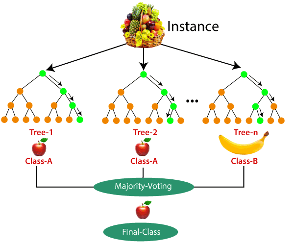
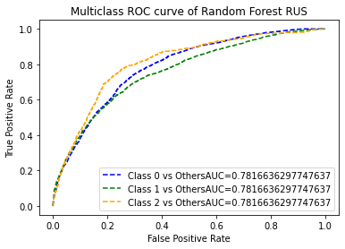
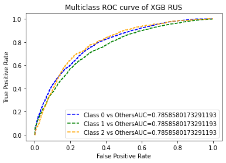

# Email Campaign Effectiveness Prediction

Most of the small to medium business owners are making effective use of Gmail-based Email marketing Strategies for offline targeting of converting their prospective customers into leads so that they stay with them in business. The main objective is to create a machine learning model to characterize the mail and track the mail that is ignored; read; acknowledged by the reader. Data columns are self-explanatory.

Email marketing is the act of sending a commercial message, typically to a group of people,
using email. In its broadest sense, every email sent to a potential or current customer
could be considered email marketing. It involves using email to send advertisements,
request business, or solicit sales or donations. Most importantly, email marketing allows businesses to build relationships with leads, new
customers and past customers. It's a way to communicate directly to the customers in their
inbox, at a time that is convenient for them. With the right messaging tone and strategies,
emails are one of the most important marketing channels.

We all subscribe to many different kinds of businesses through emails because it's required
to do so, sometimes to get digital receipts of the things we bought or to get digital
information about the business to stay updated. But many of times we do not tend to read
an email due to a number of reasons - to name a few would be- no proper structure, too
many images, too many links inside the mail, complex vocabulary used or simply too long
emails.

The main objective is to create a machine learning model to characterize the mail and track the mail that is ignored; read; acknowledged by the reader. In addition to this, we will be trying to analyze and find all the features that are important
for an email to not get ignored.

In short, we'll see Email Campaign Effectiveness Prediction using machine learning algorithms.

Explored and analyzed the data to discover key factors responsible for email marketing growth.

2 - Mail that is acknowledged by the reader

1 - Mail that is read

0 - mail that is ignored 

## Machine Learning Model Results:

### Machine learning:

Machine learning is a class of methods for automatically creating models from data.
Machine learning algorithms are the engines of machine learning, meaning it is the
algorithms that turn a data set into a model. Which kind of algorithm works best
(supervised, unsupervised, classification, regression, etc.) depends on the kind of problem
we are solving, the computing resources available, and the nature of the data.

### Random Forests:

Random Forest Regression is an ensemble learning algorithm that operates by
aggregating many random decision trees to make predictions while avoiding overfitting.
I have started by using the Random Forest algorithm for sales prediction because its
bagging techniques are robust to data anomalies (like missing data) and because random
forest packages are widely available. In particular, I used Random Forest package to carry
out the training and prediction. We then used parameter optimization to improve on our
prediction model.

### XGBoost:
XGBoost is an algorithm that has recently been dominating applied machine learning and
Kaggle competitions for structured or tabular data. XGBoost is an implementation of
gradient boosted decision trees designed for speed and performance.

# Conclusion

• It was observed that both Time_Email_Sent and Customer_Location were
insignificant in determining the Email_status. The ratio of the Email_Status was the
same irrespective of the demographic location or the time frame the emails were
sent on.
• In the Email Campaign Type feature, it seems like in campaign type 1 very few
emails were sent but has a very high likelihood of getting read. Most emails were
sent under email campaign type 2 and most ignored. Seems like campaign 3 was a
success as even when less number of emails were sent under campaign 3, more
emails were read and acknowledged.

• Analyzing total past communications, we can see that the more the number of
previous emails, the more it leads to read and acknowledged emails. This is just
about making connection with your customers.

• The more the words in an email, the more it has a tendency it has to get ignored.
Too lengthy emails are getting ignored.

• More images were there in ignored emails.

• There are outliers in almost every continuous variable except Word Count and upon
analyzing, it was found that outliers make up for more than 5% of the minority data
and will influence the results either way, so it was better not to get rid of them.

• There are outliers in almost every continuous variable except Word Count and upon
analyzing, it was found that outliers make up for more than 5% of the minority data
and will influence the results either way, so it was better not to get rid of them.

• Email Campaign Type 1 and 2 are doing better than 3. So, focusing on improving
3, can do the trick.

• The word count should be reasonable. The content should be crisp and to the point
with a few marketing gimmicks.

• Total past communications had a positive influence, hence having a healthy
relationship with customers is a big yes.
